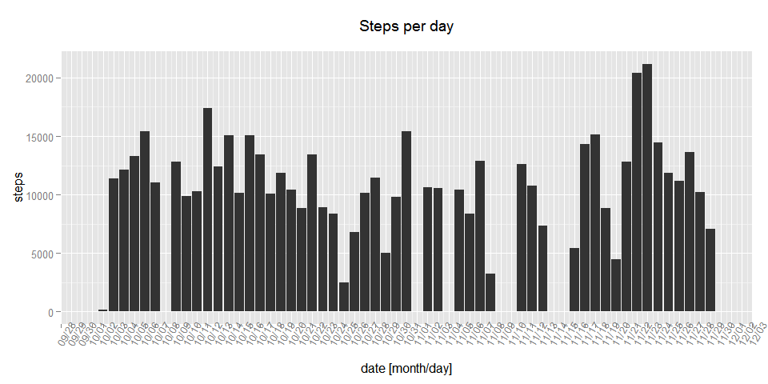
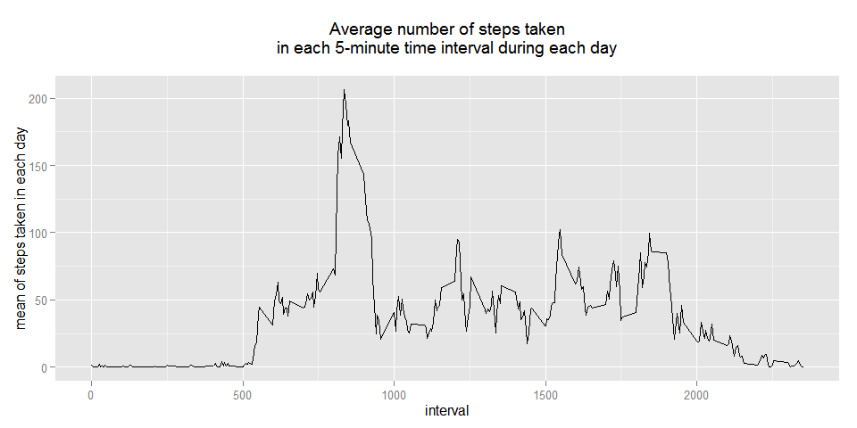
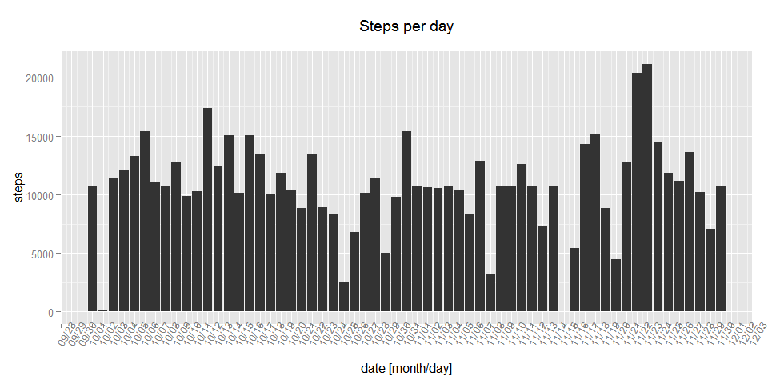
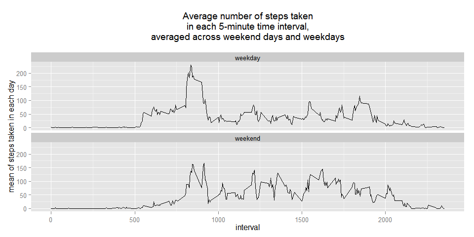

# Reproducible Research: Peer Assessment 1
This is Peer Assignment 1 for the Coursera course "Reproducible Research".

<br>

## Loading and preprocessing the data
Here is all the code responsible for some initial settings and loading required packages.

```r
Sys.setlocale(category = "LC_TIME", locale = "C")
```

```
## [1] "C"
```

```r
library(ggplot2)
library(plyr)
library(scales)
```

Data is loaded in. No preprocessing at this point was found to be necessary.

```r
if (!file.exists("activity.csv")) {
    unzip("activity.zip")
}
activityOriginal<-read.csv("activity.csv")
```

<br>

## What is mean total number of steps taken per day?

1. For this part of the assignment, first a suitable data transformation is perfomed to add the variable `dailySteps`, which is mean number of steps taken per day.

```r
activity<-ddply(activityOriginal, .(date), transform, dailySteps = sum(steps, na.rm=T))
activity$date <- as.Date(activity$date)
```

The computed values are plotted.

```r
ggplot(data=activity) +
    geom_bar(aes(x=date, y=steps), stat="identity") +
    scale_x_date(breaks = "day", labels=date_format("%m/%d"), 
                 limits=c(as.Date("2012-10-01"), as.Date("2012-11-30"))) +
    theme(axis.text.x=element_text(angle=60)) +
    xlab("date [month/day]") +
    ylab("steps") +
    ggtitle("Steps per day\n")
```

```
## Warning: Removed 2304 rows containing missing values (position_stack).
```

 

2. The mean and median is calculated for number of steps per day.

```r
meanDailySteps <- round(mean(activity$dailySteps), 0)
medianDailySteps <- median(activity$dailySteps)
```
The mean is 9354 and the median is 1.0395 &times; 10<sup>4</sup>.

<br>

## What is the average daily activity pattern?

1. The data is transformed to add the variable `intervalStepsMean`, which is the average number of steps taken in each 5-minute interval, averaged across all days.

```r
activity <- ddply(activity, .(interval), transform, intervalStepsMean = mean(steps, na.rm=T))
```

The data is plotted.

```r
ggplot(data=activity) +
    aes(x=interval, y=intervalStepsMean) +
    geom_line() +
    ylab("mean of steps taken in each day") +
    ggtitle("Average number of steps taken\nin each 5-minute time interval during each day\n")
```

 

2. The 5-minute interval, that contains the maximum number of steps, is computed.

```r
maxStepsInterval <- 
    activity$interval[activity$intervalStepsMean==max(activity$intervalStepsMean, na.rm=T)][1]
```
The interval with maximum number of steps is 835.

<br>

## Imputing missing values

1. The total number of NAs in the dataset is computed.

```r
sumNAs <- sum(is.na(activity$steps))
```
The number of NAs is 2304

2. The NAs are filled with the mean for the corresponding 5-minute interval average number of steps.

```r
activityFilledNAs <- activity
activityFilledNAs$steps[is.na(activityFilledNAs$steps)] <- 
    activityFilledNAs$intervalStepsMean[is.na(activityFilledNAs$steps)]
```

3. A dataset analoguous to the original one, but with NAs filled in, is created.

```r
activityFilledNAs <- activityFilledNAs[c(1,2,3)]
```

4. The data is plotted.

```r
ggplot(data=activityFilledNAs) +
    geom_bar(aes(x=date, y=steps), stat="identity") +
    scale_x_date(breaks = "day", labels=date_format("%m/%d"),
                 limits=c(as.Date("2012-10-01"), as.Date("2012-11-30"))) +
    theme(axis.text.x=element_text(angle=60)) +
    labs(x="date [month/day]", y="steps", title = "Steps per day\n")
```

 

The mean and median is calculated for number of steps per day for the data with NAs filled in.

```r
activityFilledNAs <-
    ddply(activityFilledNAs, .(date), transform, dailySteps = sum(steps, na.rm=T))

meanDailyStepsFilledNAs <- round(mean(activityFilledNAs$dailySteps), 0)
medianDailyStepsFilledNAs <- median(activityFilledNAs$dailySteps)
```
The mean is 1.0766 &times; 10<sup>4</sup> and the median is 1.0766 &times; 10<sup>4</sup>.

These values differ from the ones obtained for the original data. Imputing the missing values caused the mean distribution to be more symmetric, and the median approaching the mean.

<br>

## Are there differences in activity patterns between weekdays and weekends?

1. New variables are added to dataset with filled NAs: `day`, which is a factor variable with levels `"weekday"` and `"weekend"`, allowing to distinguish between the weekend days and the weekdays, and `intervalStepsMeanDay`, which is the average number of steps for each 5-minute interval dependent on the `day` factor.

```r
weekday <- c("Monday", "Tuesday", "Wednesday", "Thursday", "Friday")
weekend <- c("Saturday", "Sunday")
activityFilledNAs$day[(weekdays(activityFilledNAs$date) %in% weekday)] <- "weekday"
activityFilledNAs$day[(weekdays(activityFilledNAs$date) %in% weekend)] <- "weekend"
activityFilledNAs$day <-as.factor(activityFilledNAs$day)

activityFilledNAs <- ddply(activityFilledNAs, .(interval, day),
                           transform, intervalStepsMeanDay = mean(steps, na.rm=T))
```

2. The panel plot for the average number of steps taken in each 5-minute time interval during each day, averaged across weekend days and weekdays is made.

```r
ggplot (data=activityFilledNAs) +
    aes(y = intervalStepsMeanDay, x = interval) +
    geom_line() + 
    facet_grid(.~day) +
    facet_wrap(~day, ncol=1) +
    labs(y = "mean of steps taken in each day", title = "Average number of steps taken\nin each 5-minute time interval,\naveraged across weekend days and weekdays\n")
```

 

The initial locale settings are restored.

```r
Sys.setlocale(category = "LC_ALL", locale = "")
```

```
## [1] "LC_COLLATE=Polish_Poland.1250;LC_CTYPE=Polish_Poland.1250;LC_MONETARY=Polish_Poland.1250;LC_NUMERIC=C;LC_TIME=Polish_Poland.1250"
```
